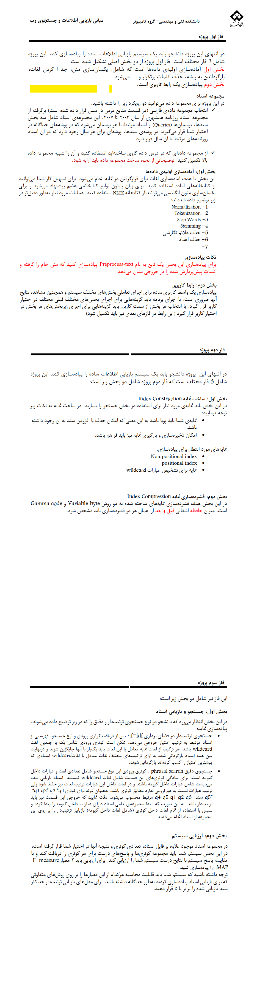

# **🔎 Search Engine Information Retrieval Project | پروژه موتور جستجو بازیابی اطلاعات**

**A university project with several different phases in which a search engine is designed to retrieve information and documents.**

**یک پروژه دانشگاهی با چندین فاز مختلف که در آن موتور جستجو ای برای بازیابی اطلاعات و اسناد طراحی میشود.**

# 💬 **نکات پروژه**

* گزارش و عکس‌های برنامه در دایرکتوری Report قرار دارند.
* برای اجرا برنامه، به پایتون بالاتر از نسخه 3.6 نیاز دارید.
* کتابخانه‌های مورد نیاز در فایل requirements.txt قرار دارند.
* برای دسترسی به همه‌ی پروژه‌های دانشگاهی من، به این لینک مراجعه کنید:

👈🏻 **[پروژه‌های دانشگاهی من](https://github.com/bestmahdi2/Uni__Bachelors_SKU_Path)**

# 📝 **توضیحات پروژه**

